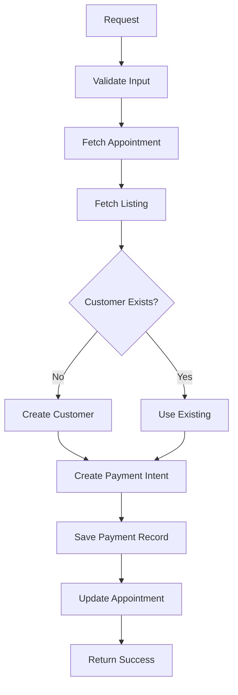

# OnvoPay Payment Authorization

Edge function para autorización de pagos utilizando OnvoPay API.

## Estructura del Proyecto

```
onvopay-authorize/
├── index.ts         # Handler principal (punto de entrada)
├── types.ts         # Definiciones de tipos TypeScript
├── config.ts        # Configuración y variables de entorno
├── utils.ts         # Funciones utilitarias
├── customer.ts      # Gestión de clientes OnvoPay
├── payment.ts       # Creación de payment intents
└── README.md        # Esta documentación
```

## Módulos

### `index.ts`
Handler principal que coordina todo el flujo:
1. Validación de entrada
2. Obtención de datos de cita y servicio
3. Gestión de clientes
4. Creación de payment intent
5. Guardado de registro de pago

### `types.ts`
Definiciones de tipos TypeScript para:
- Configuración de OnvoPay
- Datos de tarjeta y billing
- Requests y responses
- Errores personalizados

### `config.ts`
Configuración centralizada:
- Headers CORS
- Variables de entorno
- Feature flags (CUSTOMER_OPTIONAL)
- URLs de API

### `utils.ts`
Utilidades generales:
- Formateo de teléfonos
- Normalización de datos
- Cálculo de montos (IVA)
- Detección de errores de servicio

### `customer.ts`
Gestión de clientes OnvoPay:
- Búsqueda de clientes existentes
- Deduplicación por email/phone
- Creación de nuevos clientes
- Manejo de race conditions

### `payment.ts`
Creación de payment intents:
- Llamadas a API OnvoPay
- Lógica de reintentos
- Manejo de timeouts
- Validación de respuestas

## Variables de Entorno

| Variable | Descripción | Requerido |
|----------|-------------|-----------|
| `ONVOPAY_SECRET_KEY` | API key de OnvoPay | ✅ Sí |
| `ONVOPAY_API_BASE` | URL base de API | ❌ No (default: https://api.onvopay.com) |
| `ONVOPAY_API_VERSION` | Versión de API | ❌ No (default: v1) |
| `ONVOPAY_DEBUG` | Modo debug | ❌ No (default: false) |
| `ONVOPAY_CUSTOMER_OPTIONAL` | Bypass de customer en errores | ❌ No (default: true) |
| `SUPABASE_URL` | URL de Supabase | ✅ Sí |
| `SUPABASE_SERVICE_ROLE_KEY` | Service role key | ✅ Sí |

## Request Format

```typescript
POST /onvopay-authorize

{
  "appointmentId": "uuid",
  "amount": 10000,  // En colones
  "card_data": {
    "number": "4242424242424242",
    "expiry": "12/25",
    "cvv": "123",
    "name": "Juan Pérez"
  },
  "billing_info": {
    "name": "Juan Pérez",
    "email": "juan@example.com",
    "phone": "88887777",
    "address": "San José, Costa Rica"
  },
  "payment_type": "appointment"  // opcional
}
```

## Response Format

### Success (200)
```typescript
{
  "success": true,
  "id": "uuid",
  "payment_id": "uuid",
  "appointment_id": "uuid",
  "status": "pending_authorization",
  "onvopay_payment_id": "pi_xxx",
  "amount": 10000,
  "currency": "USD",
  "is_post_payment": false,
  "requires_confirmation": true,
  "message": "Payment Intent creado...",
  "timestamp": "2025-01-01T00:00:00.000Z"
}
```

### Error (4xx/5xx)
```typescript
{
  "error": "ERROR_CODE",
  "message": "Descripción del error",
  "hint": "Sugerencia para resolver",
  "phase": "create-payment-intent",
  "debug": { ... }
}
```

## Características

### ✅ Gestión Robusta de Clientes
- Deduplicación automática por email/phone
- Manejo de race conditions
- Reutilización de clientes existentes

### ✅ Reintentos Automáticos
- Exponential backoff
- Hasta 3 intentos por operación
- Timeouts configurables

### ✅ Manejo de Errores
- Detección de servicio caído
- Bypass opcional cuando OnvoPay está down
- Mensajes de error descriptivos

### ✅ Logging Estructurado
- Tracking con requestId único
- Logs por fase de ejecución
- Métricas de duración

### ✅ Soporte Post-Payment
- Servicios de pago posterior
- Almacenamiento seguro de datos de tarjeta
- Captura diferida

## Desarrollo

### Logs
Los logs incluyen emojis para facilitar el debugging:
- 🚀 Inicio de función
- 📦 Parsing de datos
- 🔐 Creación de payment intent
- ✅ Éxito
- ❌ Error
- ⚠️ Advertencia
- ⏳ Reintento

### Testing Local
```bash
# Ejecutar función localmente
supabase functions serve onvopay-authorize

# Invocar función
curl -X POST http://localhost:54321/functions/v1/onvopay-authorize \
  -H "Content-Type: application/json" \
  -d @test-payload.json
```

## Flujo de Ejecución



## Seguridad

- ✅ CORS habilitado para frontend
- ✅ Validación de JWT (configurado en config.toml)
- ✅ Service role key para operaciones admin
- ✅ No se almacenan datos completos de tarjeta
- ✅ Cifrado de datos sensibles en post-payment

## Mantenimiento

### Actualización de OnvoPay API
Si OnvoPay cambia su API, actualiza:
1. `config.ts` - URLs y versiones
2. `payment.ts` - Formato de request
3. `types.ts` - Nuevos tipos

### Agregar Nuevos Métodos de Pago
1. Crear nuevo módulo (ej: `payment-sinpe.ts`)
2. Actualizar `types.ts` con nuevos tipos
3. Modificar `index.ts` para routing

## Troubleshooting

### "ONVOPAY_SECRET_KEY not configured"
- Verifica las variables de entorno en Supabase
- Dashboard → Settings → Edge Functions

### "Non-JSON response from OnvoPay"
- Verifica URL base (sandbox vs production)
- Verifica endpoint (/v1/payment-intents con guiones)
- Posible mantenimiento de OnvoPay

### "Customer creation failed"
- Verifica que user tenga email o phone
- Revisa logs para detalles específicos
- Puede ser bypass temporal si `CUSTOMER_OPTIONAL=true`
